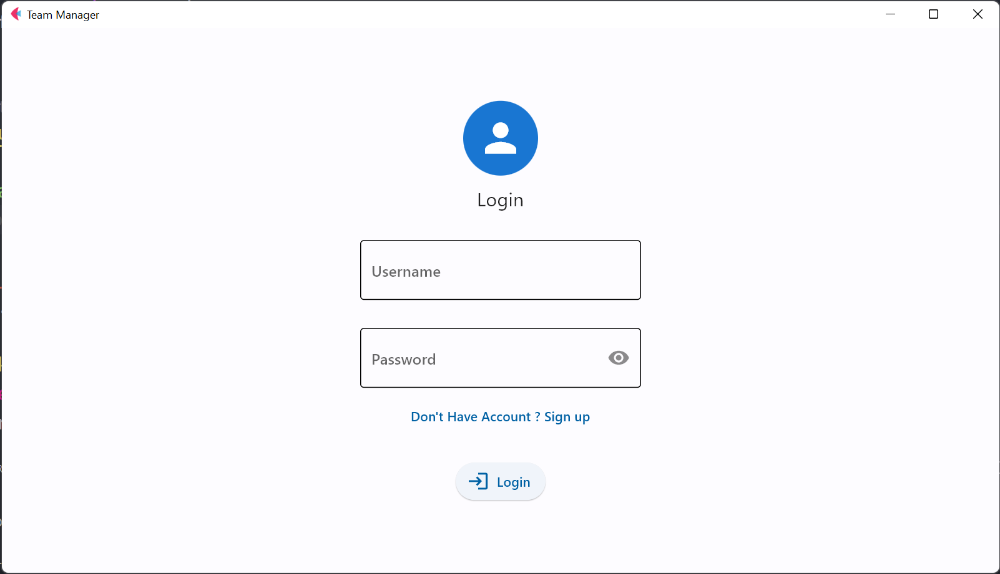
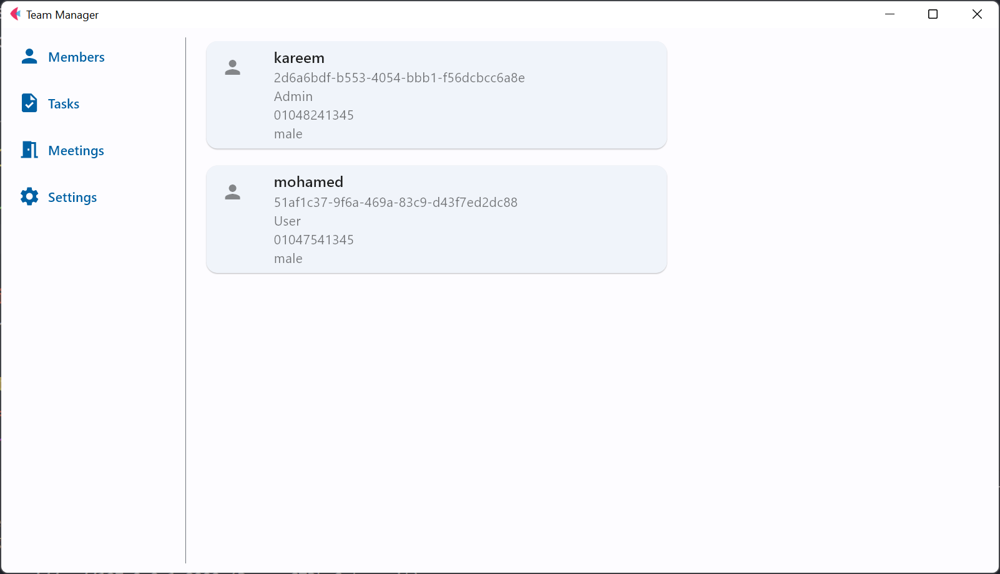
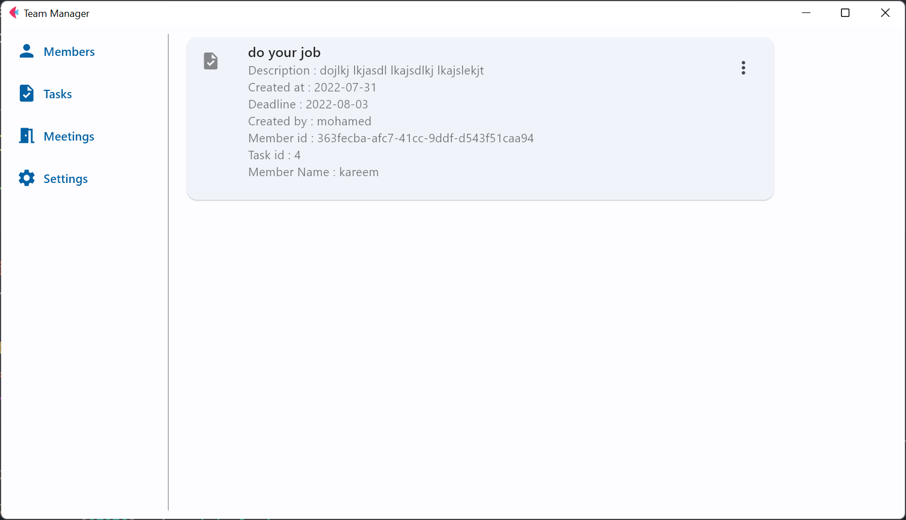

# FastAPI based SSE tracker

FastAPI based SSE tracker is a simple project that combines two frameworks , Flet and FastAPI.

SSE are displayed on the SSE board, and can be filtered from the members page.

## Project Build
* Fronted with Flet 
* Backend API with FastAPI
* Backend Database with Postgresql

## Login Page

## Members Dashboard

## Tasks Dashboard

